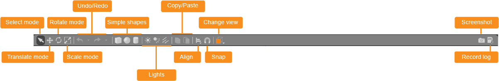
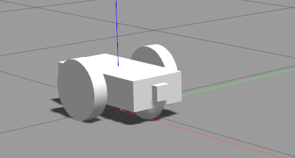
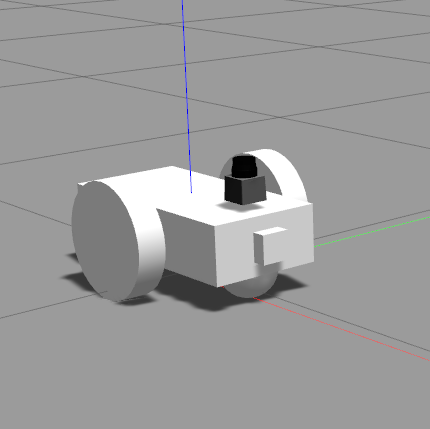

# Gazebo Intro

## Software Setup
```bash
mkdir -p ~/ur_ws/src/ && cd ~/ur_ws/src/ #Create a dir & move
git clone https://github.com/ros-industrial/universal_robot.git && cd universal_robot && git checkout melodic-devel # Clone unversial robot 
cd ../../

# checking dependencies
rosdep update
rosdep install --rosdistro $ROS_DISTRO --ignore-src --from-paths src
catkin_make # Compile the code
source devel/setup.zsh # Source the environment variable
roslaunch ur_gazebo ur10_bringup.launch # Launcg the UR10
```
#### Output


## Gazebo Simulation:
The <b>Open Source Robotics Foundation</b> maintains Gazebo, a simulator for robotics environments (OSRF). It enables you to quickly test algorithms, design robots, train AI systems, and more.

Gazebo is the <b>Robot Operating System's default simulator (ROS1 & ROS2)</b>. It offers dynamic simulations with various physics engines, advanced 3D graphics, sensors, robot plugins, and ready-to-use robot models.

Note:
Gazebo uses the Physics Engine to simulate the dynamics and kinematics of rigid bodies, as well as collision tests. Gazebo can run simulations using a variety of physics engines. The default physics engine is ODE, but other physics engines, such as Bullet, Simbody, and DART, can be integrated into Gazebo based on the user's preferences.

## Gazebo Features:
Dynamics Simulation: Model a robot's dynamics with a high-performance physics engine.
Advanced 3D Graphics: Render your environment with high-fidelity graphics, including lighting, shadows, and textures.
Sensors: Add sensors to your robot, generate data, and simulate noise.
Plugins: Write a plugin to interact with your world, robot, or sensor.
Model Database: Download a robot or environment from Gazebo library or build your own through their engine.
Socket-Based Communication: Interact with Gazebo running on a remote server through socket-based communication.
Cloud Simulation: Run Gazebo on a server and interact with it through a browser.
Command Line Tools: Control your simulated environment through the command line tools.

## Gazebo Components


### World
The simulation's entire environment is represented by the world. Everything is included and described in a.world file. This file is in SDF format (Simulation Description Format).

### Models
The world file describes a scene that contains objects and models (robots are models). Here, we define the individual models.


## Gzserver and Gzclient
```bash
[~/ur_ws]$ ps -ax | grep gz
 263455 ?        Ss     0:00 /bin/sh /opt/ros/noetic/lib/gazebo_ros/gzserver -e ode worlds/empty.world __name:=gazebo __log:=/home/nullbyte/.ros/log/e4f6fe86-7526-11ed-8781-35de3e2460bc/gazebo-3.log
 263460 ?        Ss     0:00 /bin/sh /opt/ros/noetic/lib/gazebo_ros/gzclient __name:=gazebo_gui __log:=/home/nullbyte/.ros/log/e4f6fe86-7526-11ed-8781-35de3e2460bc/gazebo_gui-4.log
```
Gazebo uses a distributed architecture with separate libraries for physics simulation, rendering, user interface, communication, and sensor generation. Additionally, gazebo provides two executable programs for running simulations:

a server <b>gzserver</b> for simulating the physics, rendering, and sensors

a client <b>gzclient</b> that provides a graphical interface to visualize and interact with the simulation

The client and server communicate using the gazebo communication library.

### Communication Between Processes
The communication library currently uses the open source <b>Google Protobuf</b> for the message serialization and <b>boost::ASIO</b> for the transport mechanism. It supports the publish/subscribe communication paradigm. For example, a simulated world publishes body pose updates, and sensor generation and GUI will consume these messages to produce output.

This mechanism allows for introspection of a running simulation, and provides a convenient mechanism to control aspects of Gazebo.

## Graphical User Interface
### Toolbar



### Select mode: Navigate in the scene


### Translate mode: Select models you want to move


### Rotate mode: Select models you want to rotate


### Scale mode: Select models you want to scale
### Undo/Redo: Undo/redo actions in the scene
### Simple shapes: Insert simple shapes into the scene


### Lights: Add lights to the scene


### Copy/paste: Copy/paste models in the scene
### Align: Align models to one another
### Snap: Snap one model to another
### Change view: View the scene from various angles


## URDF
The Unified Robot Description Format (URDF) is a XML file format used to describe the physical structure and appearance of a robot. URDF files are commonly used in robotics to define the structure of a robot and its various components, such as links, joints, and visual elements. This information can be used to simulate the robot's movements and interactions with its environment, as well as to control the robot in real-world applications. URDF files are typically used in conjunction with other software tools, such as robot operating systems (ROS) and physics engines, to provide a complete simulation and control system for the robot.

## Why we need to simulate the Robot before deploy it on Hardware:
There are several reasons why simulating robots is useful.
1. Simulating a robot allows you to test and develop control algorithms and other software without the need for a physical robot. This can save time and money, as well as reduce the risk of damaging the robot or causing harm to those around it. 
2. Simulating a robot allows you to accurately predict and analyze the robot's behavior in a variety of environments and scenarios. This can help you understand how the robot will behave in the real world, and can also help you identify potential problems or design flaws. 
3. Simulating a robot can help you visualize and understand the robot's movements and interactions with its environment, which can be helpful for debugging and development. Overall, simulating robots can be a valuable tool for robot design, development, and analysis.
  
Why URDF instead of SDF?
Gazebo adopts the SDF format to describe worlds, models, robots, and other necessary components to build entire simulations. So why are you building robots with URDF?

ROS tools are built for URDF, for example, RVIZ. Gazebo converts URDF files to SDF under the hood whenever you spawn a URDF-defined robot in a Gazebo simulation.

It will be covered in the following unit when you spawn the robot into a Gazebo simulation and make it work with ROS.

# Links and Joints
Human             |  Robotic ARM                       | Mobile Robot
:-------------------------:|:-------------------------:|-------------:
  |   | 

A robot joint is a mechanical device that connects two robot links together. A robot link is a rigid body that makes up a part of a robot's body. The links and joints of a robot work together to allow the robot to move and manipulate objects in its environment. For example, the links and joints of a robot arm allow the arm to move and rotate in various directions, allowing the robot to pick up and manipulate objects.

There are three main types of links in a URDF file:
Visual links: Visual links are used to define the appearance of the robot, such as its color and texture.

Collision links: Collision links are used to define the robot's collision geometry, which is used for simulating collisions and other physical interactions between the robot and its environment.

Inertial links: Inertial links are used to define the robot's mass, center of mass, and inertial properties, which are used for simulating the robot's dynamics and motion.


In a URDF file, each link is given a unique name, and its geometric and inertial properties are defined using XML elements. The links are then connected together using joint elements, which define the type of joint (e.g. revolute, prismatic) and its kinematic parameters (e.g. joint axis, joint limits). This allows the robot to be represented as a kinematic chain, which can be used to calculate the robot's pose and motion.

### DOF
Degree of freedom (DOF) refers to the number of independent movements that a robot or mechanism can perform. In other words, it is a measure of the number of dimensions in which a system is capable of moving. For example, a robot arm with three DOF is able to move in three dimensions (i.e. up/down, left/right, and forward/backward) and can therefore reach a wide range of positions in space.

DOF is a fundamental concept in robotics and mechanics, as it determines the range of motion and capabilities of a robot or mechanism. The more DOF a system has, the more versatile it is and the more complex its control system needs to be.

In addition to robots, the concept of DOF also applies to other types of mechanical systems, such as vehicles and aircraft. For example, a car has four DOF (corresponding to its ability to move forward/backward and turn left/right), while an airplane has six DOF (corresponding to its ability to move in three dimensions and rotate about its pitch, roll, and yaw axes).


## Create a Robot
### Create and initialize catkin_ws
```bash
mkdir -p ~/mobile_robot_ws/src/
cd ~/mobile_robot_ws/src
catkin_init_workspace
```

### Create Package
```bash
cd ~/mobile_robot_ws/src
catkin_create_pkg mobile_robot 
```

### Create a Worlds and Launch directory
```bash
cd ~/mobile_robot_ws/src/mobile_robot/
mkdir worlds launch
```

### Create a Empty GAZEBO World
```bash
cd ~/mobile_robot_ws/src/mobile_robot/worlds/
touch empty.world
```

```python
# empty.world
```
```xml
<?xml version="1.0" ?>

<sdf version="1.4">

  <world name="default">

    <include>
      <uri>model://ground_plane</uri>
    </include>

    <!-- Light source -->
    <include>
      <uri>model://sun</uri>
    </include>

    <!-- World camera -->
    <gui fullscreen='0'>
      <camera name='world_camera'>
        <pose>4.927360 -4.376610 3.740080 0.000000 0.275643 2.356190</pose>
        <view_controller>orbit</view_controller>
      </camera>
    </gui>

  </world>
</sdf>
```

The <b>.world</b> file uses the XML file format to describe all the elements with respect to the Gazebo environment. The simple world that you are creating here has the following elements:

<b>sdf:</b> The base element which encapsulates the entire file structure and content.</br>
<b>world:</b> The world element defines the world description and several properties pertaining to that world. In this example, you are adding a ground plane, a light source, and a camera to your world. Each model or property can have further elements that add detail. For example, the camera has a pose element which defines its position and orientation.</br>
<b>include</b>: The include element, along with the uri element, provide a path to a particular model. In Gazebo there are several models that are available by default.</br>

### Create a Launch File
Launch files in ROS allow us to execute more than one node simultaneously, which helps avoid the potentially tedious task of defining and launching several nodes in separate shells or terminals.

```bash
cd ~/mobile_robot/src/mobile_robot/launch/
touch world.launch
```

```python
#world.launch
```
```xml
<?xml version="1.0" encoding="UTF-8"?>

<launch>

  <!-- World File -->
  <arg name="world_file" default="$(find mobile_robot)/worlds/empty.world"/>

  <!-- Launch Gazebo World -->
  <include file="$(find gazebo_ros)/launch/empty_world.launch">
    <arg name="use_sim_time" value="true"/>
    <arg name="debug" value="false"/>
    <arg name="gui" value="true" />
    <arg name="world_name" value="$(arg world_file)"/>
  </include>

</launch>
```
the <b>.launch</b> files are also based on XML. The structure for the launch files has two parts -

* First, define arguments using the <b>arg</b> element. Each such element will have a name attribute and a default value.

* Second, include the <b>world.launch</b> file from the gazebo_ros package. The empty_world file includes a set of important definitions that are inherited by the world that we create. Using the world_name argument and the path to your .world file passed as the value to that argument, you will be able to launch your world in Gazebo.

### Launch the Empty world
```bash
cd ~/mobile_robot_ws/
catkin_make
source devel/setup.bash
roslaunch mobile_robot world.launch
```

### Mobile Robot Basic Setup

### Create the URDF File
```bash
cd ~/mobile_robot_ws/src/mobile_robot/
mkdir urdf
```

### Create the Robot Model file
```bash
cd ~/mobile_robot_ws/src/mobile_robot/urdf/
touch mobile_robot.xacro
```
```python
# mobile_robot.xacro
```
```xml
<?xml version='1.0'?>

<robot name="mobile_robot" xmlns:xacro="http://www.ros.org/wiki/xacro">

  <link name="robot_footprint"></link>

  <joint name="robot_footprint_joint" type="fixed">
    <origin xyz="0 0 0" rpy="0 0 0" />
    <parent link="robot_footprint"/>
    <child link="chassis" />
  </joint>

  <link name='chassis'>
    <pose>0 0 0.1 0 0 0</pose>

    <inertial>
      <mass value="15.0"/>
      <origin xyz="0.0 0 0" rpy=" 0 0 0"/>
      <inertia
          ixx="0.1" ixy="0" ixz="0"
          iyy="0.1" iyz="0"
          izz="0.1"
      />
    </inertial>

    <collision name='collision'>
      <origin xyz="0 0 0" rpy=" 0 0 0"/> 
      <geometry>
        <box size=".4 .2 .1"/>
      </geometry>
    </collision>

    <visual name='chassis_visual'>
      <origin xyz="0 0 0" rpy=" 0 0 0"/>
      <geometry>
        <box size=".4 .2 .1"/>
      </geometry>
    </visual>


    <collision name='back_caster_collision'>
      <origin xyz="-0.15 0 -0.05" rpy=" 0 0 0"/>
      <geometry>
        <sphere radius="0.0499"/>
      </geometry>
    </collision>

    <visual name='back_caster_visual'>
      <origin xyz="-0.15 0 -0.05" rpy=" 0 0 0"/>
      <geometry>
        <sphere radius="0.05"/>
      </geometry>
    </visual>

    <collision name='front_caster_collision'>
      <origin xyz="0.15 0 -0.05" rpy=" 0 0 0"/>
      <geometry>
        <sphere radius="0.0499"/>
      </geometry>
    </collision>

    <visual name='front_caster_visual'>
      <origin xyz="0.15 0 -0.05" rpy=" 0 0 0"/>
      <geometry>
        <sphere radius="0.05"/>
      </geometry>
    </visual>

  </link>

</robot>
```

Lets understand the URDF Content, 
```xml
<robot> </robot>
This is a top level tag that contains all the other tags related to a given robot.

<link> </link>
Each rigid link in a robot must have this tag associated with it.

Attributes
name: Requires a unique link name attribute.
```
```xml
<visual> </visual>
This element specifies the appearance of the object for visualization purposes.
```

```xml
<origin>	
The reference frame of the visual element with respect to the reference frame of the link.
<geometry>	
The shape of the visual object.
<material>
The material of the visual element.
```

```xml
<collision> </collision>
The collision properties of a link. Note that this can be different from the visual properties of a link, for example, simpler collision models are often used to reduce computation time.
```

```xml
<origin>	
The reference frame of the collision element, relative to the reference frame of the link.
<geometry>
See the geometry description in the above visual element.
```

```xml
<inertial> </inertial>
The inertial properties of the link are described within this tag.
```

```xml
<origin>
This is the pose of the inertial reference frame, relative to the link reference frame. The origin of the inertial reference frame needs to be at the center of gravity.
<mass>
The mass of the link is represented by the value attribute of this element.
<inertia>
The 3x3 rotational inertia matrix, represented in the inertia frame. Because the rotational inertia matrix is symmetric, only 6 above-diagonal elements of this matrix are specified here, using the attributes ixx, ixy, ixz, iyy, iyz, izz.
```
```xml
<joint> </joint>
This tag typically defines a single joint between two links in a robot. The type of joints you can define using this tag include:
```

```xml
Fixed	Rigid joint with no degrees of freedom. Used to weld links together.
Revolute	A range-limited joint that rotates about an axis.
Prismatic	A range-limited joint that slides along an axis
Continuous	Similar to Revolute joint but has no limits. It can rotate continuously about an axis.
Planar	A 2D Prismatic joint that allows motion in a plane perpendicular to an axis.
Floating	A joint with 6 degrees of freedom, generally used for Quadrotors and UAVs
```

#### Elements
```xml
<origin>	This is the transform from the parent link to the child link. The joint is located at the origin of the child link.
<parent>	Name of the Parent link for the respective joint.
<child>	Name of the child link for the respective joint.
<axis>	Defines the axis of rotation for revolute joints, the axis of translation for prismatic joints, and the surface normal for planar joints. Fixed and floating joints do not use the axis field.
```

The chassis is a cube, whereas the casters are spherical, as denoted by their <geometry> tags. Each link (or joint) has an origin (or pose), as well. Every element of that link or joint will have its own origin, which will be relative to the link's frame of reference.

Note:

For this base, the casters are included as part of the link for stability. There is no need for any additional links to define the casters, and therefore no joints to connect them. The casters do, however, have friction coefficients defined for them. These friction coefficients are set to 0, to allow for free motion while moving.

## Launch the Robot
### Create a new launch file to load the URDF model file
```bash
cd ~/mobile_robot_ws/src/mobile_robot/launch/
touch robot_description.launch
```

```python
# robot_description.launch
```
```bash
<?xml version="1.0"?>
<launch>
  <!-- send urdf to param server -->
  <param name="robot_description" command="$(find xacro)/xacro --inorder '$(find mobile_robot)/urdf/mobile_robot.xacro'" />
</launch>
```

### Update the world file
```xml
  <!-- Robot pose -->
  <arg name="x" default="0"/>
  <arg name="y" default="0"/>
  <arg name="z" default="0"/>
  <arg name="roll" default="0"/>
  <arg name="pitch" default="0"/>
  <arg name="yaw" default="0"/>

  <!-- Launch other relevant files-->
  <include file="$(find mobile_robot)/launch/robot_description.launch"/>
```

```xml
<!-- Find my robot Description-->
  <param name="robot_description" command="$(find xacro)/xacro --inorder '$(find mobile_robot)/urdf/mobile_robot.xacro'"/>

  <!-- Spawn My Robot -->
  <node name="urdf_spawner" pkg="gazebo_ros" type="spawn_model" respawn="false" output="screen" 
        args="-urdf -param robot_description -model mobile_robot 
              -x $(arg x) -y $(arg y) -z $(arg z)
              -R $(arg roll) -P $(arg pitch) -Y $(arg yaw)"/>
```

## Lets create a wheel for the Mobile robot
Make the links for each wheel according to the specifications below and add them to your Xacro file. Each wheel has a collision, inertial, and visual element, as well as the following properties:

```xml
link name - "left_wheel" "right_wheel", where the SIDE is either left or right.
geometry - "cylinder" with radius 0.1 and length 0.05.
origin for each element - [0, 0, 0, 0, 1.5707, 1.5707]
mass of each wheel - "5".
```

```xml
inertia:
ixx="0.1" ixy="0" ixz="0"
iyy="0.1" iyz="0"
izz="0.1"
```

## Lets create a joints
Once the links have been defined, the corresponding joints must be created. The following components will join your left wheel (the child link) to the robot chassis (the parent link):

```xml
  <joint type="continuous" name="left_wheel_hinge">
    <origin xyz="0 0.15 0" rpy="0 0 0"/>
    <child link="left_wheel"/>
    <parent link="chassis"/>
    <axis xyz="0 1 0" rpy="0 0 0"/>
    <limit effort="10000" velocity="1000"/>
    <dynamics damping="1.0" friction="1.0"/>
  </joint>
```

````xml
<?xml version='1.0'?>

<robot name="mobile_robot" xmlns:xacro="http://www.ros.org/wiki/xacro">

  <link name="robot_footprint"></link>

  <joint name="robot_footprint_joint" type="fixed">
    <origin xyz="0 0 0" rpy="0 0 0" />
    <parent link="robot_footprint"/>
    <child link="chassis" />
  </joint>

  <link name='chassis'>
    <pose>0 0 0.1 0 0 0</pose>

    <inertial>
      <mass value="15.0"/>
      <origin xyz="0.0 0 0" rpy=" 0 0 0"/>
      <inertia
          ixx="0.1" ixy="0" ixz="0"
          iyy="0.1" iyz="0"
          izz="0.1"
      />
    </inertial>

    <collision name='collision'>
      <origin xyz="0 0 0" rpy=" 0 0 0"/> 
      <geometry>
        <box size=".4 .2 .1"/>
      </geometry>
    </collision>

    <visual name='chassis_visual'>
      <origin xyz="0 0 0" rpy=" 0 0 0"/>
      <geometry>
        <box size=".4 .2 .1"/>
      </geometry>
    </visual>


    <collision name='back_caster_collision'>
      <origin xyz="-0.15 0 -0.05" rpy=" 0 0 0"/>
      <geometry>
        <sphere radius="0.0499"/>
      </geometry>
    </collision>

    <visual name='back_caster_visual'>
      <origin xyz="-0.15 0 -0.05" rpy=" 0 0 0"/>
      <geometry>
        <sphere radius="0.05"/>
      </geometry>
    </visual>

    <collision name='front_caster_collision'>
      <origin xyz="0.15 0 -0.05" rpy=" 0 0 0"/>
      <geometry>
        <sphere radius="0.0499"/>
      </geometry>
    </collision>

    <visual name='front_caster_visual'>
      <origin xyz="0.15 0 -0.05" rpy=" 0 0 0"/>
      <geometry>
        <sphere radius="0.05"/>
      </geometry>
    </visual>

  </link>
    <!-- Right WHEEL descriptor Start-->
  <link name='right_wheel'>
    <inertial>
      <mass value="5.0"/>
      <origin xyz="0 0 0" rpy=" 0 1.5707 1.5707"/>
      <inertia
          ixx="0.1" ixy="0" ixz="0"
          iyy="0.1" iyz="0"
          izz="0.1"
      />
    </inertial>

    <collision name='right_wheel_collision'>
      <origin xyz="0 0 0" rpy=" 0 1.5707 1.5707"/>
      <geometry>
        <cylinder radius="0.1" length="0.05"/>
      </geometry>
    </collision>

    <visual name='right_wheel_visual'>
      <origin xyz="0 0 0" rpy=" 0 1.5707 1.5707"/>
      <geometry>
        <cylinder radius="0.1" length="0.05"/>
      </geometry>
    </visual>
  </link>
  <!-- Right WHEEL descriptor End -->

  <!-- Left WHEEL descriptor Start -->
  <link name='left_wheel'>
    <inertial>
      <mass value="5.0"/>
      <origin xyz="0 0 0" rpy=" 0 1.5707 1.5707"/>
      <inertia
          ixx="0.1" ixy="0" ixz="0"
          iyy="0.1" iyz="0"
          izz="0.1"
      />
    </inertial>

    <collision name='left_wheel_collision'>
      <origin xyz="0 0 0" rpy=" 0 1.5707 1.5707"/>
      <geometry>
        <cylinder radius="0.1" length="0.05"/>
      </geometry>
    </collision>

    <visual name='left_wheel_visual'>
      <origin xyz="0 0 0" rpy=" 0 1.5707 1.5707"/>
      <geometry>
        <cylinder radius="0.1" length="0.05"/>
      </geometry>
    </visual>

  </link>

  <joint type="continuous" name="left_wheel_hinge">
    <origin xyz="0 0.15 0" rpy="0 0 0"/>
    <child link="left_wheel"/>
    <parent link="chassis"/>
    <axis xyz="0 1 0" rpy="0 0 0"/>
    <limit effort="10000" velocity="1000"/>
    <dynamics damping="1.0" friction="1.0"/>
  </joint>

  <joint type="continuous" name="right_wheel_hinge">
    <origin xyz="0 -0.15 0" rpy="0 0 0"/>
    <child link="right_wheel"/>
    <parent link="chassis"/>
    <axis xyz="0 1 0" rpy="0 0 0"/>
    <limit effort="10000" velocity="1000"/>
    <dynamics damping="1.0" friction="1.0"/>
  </joint>
  <!-- Left WHEEL descriptor End -->
</robot>
````

The joint type is set to "continuous," which is similar to a revolute joint but has no rotational limits. This means the joint can rotate indefinitely. The joint will have its own rotation axis. In addition, the joint will have limits to enforce the maximum "effort" and "velocity" for that joint. The limits are useful constraints for a real robot and can also aid in simulation. the joint will have specific joint dynamics that correspond to physical joint properties such as "damping" and "friction.


## Lets add camera and LiDAR Sensor 
<b> LiDAR </b>
Lidar is an abbreviation for Light Detection and Ranging. It senses the environment using laser arrays to create "point cloud" models. Lidar creates an accurate model of the world by measuring thousands of millions of times per second. However, the resolution is nowhere near that of a camera.

<b> Camera </b>
Cameras are one of the most common sensors in Robotics. They capture information that is easily interpreted by humans at a high resolution compared to other sensors. Every image captures millions of pixels. To extract depth information from camera images, people have started using stereo cameras. These work like your eyes do and are able to estimate distances to objects.

Lets add camera sensor based on the following specifications:
Add the camera link and a corresponding joint. Open the mobile_robot.xacro file and add a camera sensor based on the following specifications:
```xml
link name - "camera"
link origin - "[0, 0, 0, 0, 0, 0]"
geometry - box with size "[0.05, 0.05, 0.05]"
mass - "0.1"
box_inertia - m="0.1" x="0.05" y="0.05" z="0.05"
inertia - ixx="1e-6" ixy="0" ixz="0" iyy="1e-6" iyz="0" izz="1e-6"
joint name - "camera_joint"
joint type - "fixed"
joint axis - "[0, 1, 0]"
joint origin - "[0.2, 0, 0, 0, 0, 0]"
joint parent link - "chassis"
joint child link - "camera"
```

Full camera descriptor,
```xml
  <!-- RGB CAMERA descriptor Start-->
  <link name='camera'>
    <inertial>
      <mass value="0.1"/>
      <origin xyz="0 0 0" rpy="0 0 0"/>
      <inertia
          ixx="1e-6" ixy="0" ixz="0"
          iyy="1e-6" iyz="0"
	        izz="1e-6"
      />
    </inertial>

    <collision name='camera collision'>
      <origin xyz="0 0 0" rpy="0 0 0"/>
      <geometry>
        <box size="0.05 0.05 0.05"/>
      </geometry>
    </collision>

    <visual name='camera_visual'>
      <origin xyz="0 0 0" rpy="0 0 0"/>
      <geometry>
        <box size="0.05 0.05 0.05"/>
      </geometry>
    </visual>
  </link>

  <joint type="fixed" name="camera_joint">
    <origin xyz="0.2 0 0" rpy="0 0 0"/>
    <child link="camera"/>
    <parent link="chassis"/>
    <axis xyz="0 1 0" rpy="0 0 0"/>
  </joint>
  <!-- RGB CAMERA descriptor End-->
```

Note:
Each link should have its own visual, collision and inertial elements.



Now, Lets add LiDAR Sensor, 
We are going to use Hokuyo sensor. 

Except you must first add a mesh file to your robot model. Mesh files define the shape of the object or model with which you are working. Some basic shapes, such as the box or cylinder, do not require a mesh file. Mesh files, on the other hand, are required for more advanced designs. The mesh file should be saved in the meshes directory.

```bash
# Create a Mesh directory
cd ~/mobile_robot_ws/src/mobile_robot/
mkdir meshes

# Download the mesh file
cd meshes
wget https://s3-us-west-1.amazonaws.com/udacity-robotics/hokuyo.dae

# Now add the Hokuyo sensor to mobile_robot.xacro file
```

```xml
Here are the Hokuyo lidar sensor specifications:

link name - "hokuyo"
link origin - "[0, 0, 0, 0, 0, 0]"
geometry for <collision> - box with size "[0.1, 0.1, 0.1]"
geometry for <visual> - filename = “package://my_robot/meshes/hokuyo.dae”
mass - "1e-5"
inertia - ixx="1e-6" ixy="0" ixz="0" iyy="1e-6" iyz="0" izz="1e-6"
joint name - "hokuyo_joint"
joint type - "fixed"
joint axis - "[0 1 0]"
joint origin - "[0.15, 0, .1, 0, 0, 0]"
joint parent link - "chassis"
joint child link - "hokuyo"
```

Same like before, each link should have its own visual, collision and inertial elements.

```xml
  <!-- LASER descriptor start-->
  <link name="hokuyo">
    <inertial>
      <mass value="1e-5"/>
      <origin xyz="0 0 0" rpy="0 0 0"/>
      <inertia
          ixx="1e-6" ixy="0" ixz="0"
          iyy="1e-6" iyz="0"
          izz="1e-6"
      />
    </inertial>

    <collision name="hokuyo_collision">
      <origin xyz="0 0 0" rpy="0 0 0"/>
      <geometry>
        <box size="0.1 0.1 0.1"/>
      </geometry>
    </collision>

    <visual name="hokuyo_visual">
      <origin xyz="0 0 0" rpy="0 0 0"/>
      <geometry>
        <mesh filename="package://my_robot/meshes/hokuyo.dae"/>
      </geometry>
    </visual>
  </link>

  <joint type="fixed" name="hokuyo_joint">
    <origin xyz="0.15 0 0.1" rpy="0 0 0"/>
    <child link="hokuyo"/>
    <parent link="chassis"/>
    <axis xyz="0 1 0" rpy="0 0 0"/>
  </joint>
  <!-- LASER descriptor End -->
```



### Gazebo Plugins
Now we have added camera sensor to take images, Lidar sensor to take laser measurements. How does exactly the simulator know how to operate them...

We need to add two sensor and one actuators plugins, 
1. A plugin for the camera sensor
2. A plugin for the Hokuyo lidar sensor
3. A plugin for the wheel joints actuator

Lets create gazebo plugin file, 

```bash
cd ~/mobile_robot_ws/src/mobile_robot/urdf
touch mobile_robot.gazebo
```

```python
mobile_robot.gazebo
```

```xml
<?xml version="1.0"?>
<robot>
   <!-- Wheel -->
  <gazebo>
    <plugin name="differential_drive_controller" filename="libgazebo_ros_diff_drive.so">
      <legacyMode>false</legacyMode>
      <alwaysOn>true</alwaysOn>
      <updateRate>10</updateRate>
      <leftJoint>left_wheel_hinge</leftJoint>
      <rightJoint>right_wheel_hinge</rightJoint>
      <wheelSeparation>0.4</wheelSeparation>
      <wheelDiameter>0.2</wheelDiameter>
      <torque>10</torque>
      <commandTopic>cmd_vel</commandTopic>
      <odometryTopic>odom</odometryTopic>
      <odometryFrame>odom</odometryFrame>
      <robotBaseFrame>robot_footprint</robotBaseFrame>
      <publishWheelTF>false</publishWheelTF>
      <publishWheelJointState>false</publishWheelJointState>
      <rosDebugLevel>na</rosDebugLevel>
      <wheelAcceleration>0</wheelAcceleration>
      <wheelTorque>5</wheelTorque>
      <odometrySource>world</odometrySource>
      <publishTf>1</publishTf>
      <publishOdomTF>true</publishOdomTF>
    </plugin>
  </gazebo>

  <!-- camera -->
  <gazebo reference="camera">
    <sensor type="camera" name="camera1">
      <update_rate>30.0</update_rate>
      <camera name="head">
        <horizontal_fov>1.3962634</horizontal_fov>
        <image>
          <width>800</width>
          <height>800</height>
          <format>R8G8B8</format>
        </image>
        <clip>
          <near>0.02</near>
          <far>300</far>
        </clip>
      </camera>
      <plugin name="camera_controller" filename="libgazebo_ros_camera.so">
        <alwaysOn>true</alwaysOn>
        <updateRate>0.0</updateRate>
        <cameraName>camera</cameraName>
        <imageTopicName>rgb/image_raw</imageTopicName>
        <cameraInfoTopicName>rgb/camera_info</cameraInfoTopicName>
        <frameName>camera</frameName>
        <hackBaseline>0.07</hackBaseline>
        <distortionK1>0.0</distortionK1>
        <distortionK2>0.0</distortionK2>
        <distortionK3>0.0</distortionK3>
        <distortionT1>0.0</distortionT1>
        <distortionT2>0.0</distortionT2>
      </plugin>
    </sensor>
  </gazebo>

  <!-- hokuyo -->
  <gazebo reference="hokuyo">
    <sensor type="ray" name="head_hokuyo_sensor">
      <pose>0 0 0 0 0 0</pose>
      <visualize>false</visualize>
      <update_rate>40</update_rate>
      <ray>
        <scan>
          <horizontal>
            <samples>720</samples>
            <resolution>1</resolution>
            <min_angle>-1.570796</min_angle>
            <max_angle>1.570796</max_angle>
          </horizontal>
        </scan>
        <range>
          <min>0.10</min>
          <max>30.0</max>
          <resolution>0.01</resolution>
        </range>
        <noise>
          <type>gaussian</type>
          <!-- Noise parameters based on published spec for Hokuyo laser
               achieving "+-30mm" accuracy at range < 10m.  A mean of 0.0m and
               stddev of 0.01m will put 99.7% of samples within 0.03m of the true
               reading. -->
          <mean>0.0</mean>
          <stddev>0.01</stddev>
        </noise>
      </ray>
      <plugin name="gazebo_ros_head_hokuyo_controller" filename="libgazebo_ros_laser.so">
        <topicName>/scan</topicName>
        <frameName>hokuyo</frameName>
      </plugin>
    </sensor>
  </gazebo>
</robot>
```

Update the below line in the mobile_robot.xacro file,
```xml
<xacro:include filename="$(find mobile_robot)/urdf/mobile_robot.gazebo" />
```

Lets launch the simulation,
```bash
roslaunch mobile_robot world.launch
```

```bash
$ rostopic list                                            
/camera/parameter_descriptions
/camera/parameter_updates
/camera/rgb/camera_info
/camera/rgb/image_raw
/camera/rgb/image_raw/compressed
/camera/rgb/image_raw/compressed/parameter_descriptions
/camera/rgb/image_raw/compressed/parameter_updates
/camera/rgb/image_raw/compressedDepth
/camera/rgb/image_raw/compressedDepth/parameter_descriptions
/camera/rgb/image_raw/compressedDepth/parameter_updates
/camera/rgb/image_raw/theora
/camera/rgb/image_raw/theora/parameter_descriptions
/camera/rgb/image_raw/theora/parameter_updates
/clock
/cmd_vel
/gazebo/link_states
/gazebo/model_states
/gazebo/parameter_descriptions
/gazebo/parameter_updates
/gazebo/performance_metrics
/gazebo/set_link_state
/gazebo/set_model_state
/odom
/rosout
/rosout_agg
/scan
/tf

```
## RVIZ
RViz is our one-stop shop for visualising a robot's three core aspects: perception, decision-making, and actuation.

RViz, unlike Gazebo, can visualise any type of sensor data published over a ROS topic, including camera images, point clouds, ultrasonic measurements, lidar data, inertial measurements, and more. This data can be a live stream directly from the sensor, or it can be pre-recorded data saved as a bagfile.

You can also view live joint angle values from a robot and thus create a real-time 3D representation of any robot. However, RViz is not a simulator and does not communicate with a physics engine. RViz thus does not model collisions or dynamics. RViz is not a replacement for Gazebo, but rather a complementary tool for monitoring every single process running beneath the hood of a robotic system.

## Running RViz
```bash
roscore
rosrun rviz rviz
```


The empty window in the center is called 3D view. This is where you will spend most of your time observing the robot model, the sensors, and other meta-data.

The panel on the left is a list of loaded displays, while the one on the right shows different views available.

At the top we have a number of useful tools. The bottom bar displays information like time elapsed, frames per second, and some handy instructions for the selected tool.

### RVIZ Integration
Update the below content in <b> robot_description.launch</b>,
```xml
  <!-- Send fake joint values-->
  <node name="joint_state_publisher" pkg="joint_state_publisher" type="joint_state_publisher">
    <param name="use_gui" value="false"/>
  </node>

  <!-- Send robot states to tf -->
  <node name="robot_state_publisher" pkg="robot_state_publisher" type="robot_state_publisher" respawn="false" output="screen"/>
```
Those elements add two nodes - the <b>joint_state_publisher</b> and the </b>robot_state_publisher</b>.
<b>joint_state_publisher:</b> Publishes joint state messages for the robot, such as the angles for the non-fixed joints.
<b>robot_state_publisher:</b> Publishes the robot's state to tf (transform tree). Your robot model has several frames corresponding to each link/joint. The robot_state_publisher publishes the 3D poses of all of these links. This offers a convenient and efficient advantage, especially for more complicated robots.

Modify the Launch file to launch RVIZ, world.launch
```xml
<!--launch rviz-->
<node name="rviz" pkg="rviz" type="rviz" respawn="false"/>
```
```
roslaunch my_robot world.launch
```

Setup RViz to visualize the sensor readings. On the left side of RViz, under Displays:

Select odom for fixed frame
Click the Add button and
add RobotModel and your robot model should load up in RViz.
add Camera and select the Image topic that was defined in the camera Gazebo plugin
add LaserScan and select the topic that was defined in the Hokuyo Gazebo plugin

#### Gazebo View


### RVIZ View


#### Test Robot's actuators and Drive
```bash
cd ~/mobile_robot_ws/
source devel/setup.bash
rostopic pub /cmd_vel geometry_msgs/Twist  "linear:
  x: 0.1
  y: 0.0
  z: 0.0
angular:
  x: 0.0
  y: 0.0
  z: 0.1" 
```
## Create Robot Model
```bash
catkin_create_pkg my_mira_description rospy rviz controller_manager gazebo_ros joint_state_publisher robot_state_publisher
```

In the Robot Operating System (ROS), the convention for naming robot description packages is to use the robot's name followed by _description. For example, if the robot's name is "mobile_robot", the description package would be named "mobile_robot_description". This naming convention helps to clearly identify the purpose of the package, and also helps to prevent naming conflicts with other packages. Additionally, many tools and scripts in ROS expect description packages to follow this naming convention, so using it can make it easier to use these tools with your robot's description. Overall, following the robotname_description convention can help to make your robot's description more organized and consistent with other ROS packages.

What is control manager?
The control manager is a module that is responsible for coordinating the various controllers and control algorithms that are used to control a robot. This can include things like joint controllers for moving the robot's joints, as well as higher-level controllers for executing specific tasks or behaviors. The control manager is typically used to manage the flow of information between the different controllers, as well as to provide an interface for external programs or users to interact with the robot's control system. This allows different controllers to be easily added, removed, or modified, without having to make changes to the underlying control algorithms or hardware.


